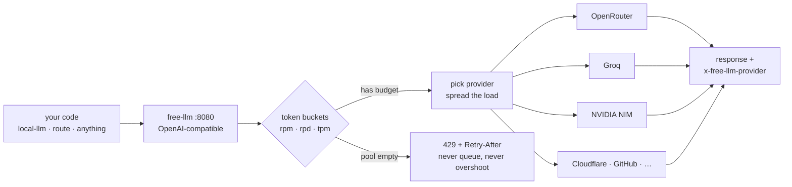

# free-llm

**Every free LLM tier is too small to be useful on its own.** Groq gives you
1,000 requests a day on its bigger models. OpenRouter, 50. Gemini's numbers
aren't published any more. Individually they're toys — so you end up either
paying, or hand-rolling key rotation and getting your accounts banned for it.

`free-llm` pools them behind **one local OpenAI-compatible endpoint** and
schedules requests so no provider's published limit is ever exceeded. One honest
key per provider, no multi-accounting, no signup automation.

```bash
$ free-llm check
✓ openrouter   339 models   151ms   budget 50/50 today   working
○ groq         GROQ_API_KEY unset — skipped

$ free-llm probe openrouter
✓ no 429 at or below 21 requests; observed RPM 20
```



It is deliberately **a proxy, not another CLI**. Point anything that speaks
OpenAI at it — including [`local-llm-skill`](https://github.com/jhammant/local-llm-skill),
which consumes it as one config line.

**Published limits are unreliable, so measure them.** `free-llm probe` ramps to
the first 429 and records the real ceiling, which then overrides config. It
never probes a *daily* limit — discovering an RPD cap means burning a day's
allowance to learn a number.

Realistic aggregate is **roughly 60–150 requests/minute** across five free tiers:
good for overnight batch, not real-time scale. Daily caps bind long before
per-minute ones, so plan around the daily budget, not the RPM sum.

## Install

Node 18 or newer is required. There are no runtime dependencies.

```sh
npm link
free-llm check
free-llm serve
```

The server binds to `127.0.0.1:8080` by default:

```text
free-llm serve [--port 8080] [--host 127.0.0.1]
free-llm status [--json]
free-llm models [--json]
free-llm log [--limit n] [--json]
free-llm check [--json]
free-llm add <provider> [--no-open] [--json]
free-llm add --all [--no-open] [--json]
free-llm probe <provider> [--dry-run] [--json]
free-llm doctor [provider] [--json]
```

An explicit non-loopback `--host` prints a warning. This process holds provider
API keys; do not expose it to a network without adding your own authentication
and transport security.

Point `local-llm` at the proxy as a generic OpenAI-compatible endpoint:

```json
{
  "id": "free",
  "kind": "openai",
  "baseUrl": "http://127.0.0.1:8080/v1"
}
```

`free-llm` deliberately has no `ask` or `batch` commands. `local-llm` already
provides those workflows.

## OpenAI-compatible API

- `POST /v1/chat/completions` supports streaming and non-streaming responses.
- `POST /v1/embeddings` uses providers configured to support embeddings.
- `GET /v1/models` lists usable aliases and configured concrete models.
- `GET /healthz` reports liveness and every provider's current budget.

Request fields are passed through unchanged except that a logical alias is
replaced with its concrete provider model. Fields such as `reasoning_effort`,
`tools`, `tool_choice`, and `response_format` are not filtered.

Every response has `x-free-llm-provider` and `x-free-llm-model` headers. For
inference responses these identify the provider and concrete model that
produced the response. `free-llm log` persists recent request attribution,
latency, status, and outcome under `~/.local/state/free-llm/requests.jsonl`.

## Configuration

The registry is `~/.config/free-llm/providers.json`. A missing file uses the
built-in starting configuration for OpenRouter, Groq, Google AI Studio,
Cerebras, and Mistral. Providers whose named environment variable is unset are
skipped.

| Provider | Key environment variable | RPM | RPD | TPM | Configured models |
|---|---|---:|---:|---:|---|
| OpenRouter | `OPENROUTER_API_KEY` | 20 | 50 | — | `*:free` |
| Groq | `GROQ_API_KEY` | 30 | 14,400 | 6,000 | `llama-3.1-8b-instant` |
| Google AI Studio | `GOOGLE_AI_API_KEY` | 10 | 250 | 250,000 | `gemini-2.5-flash-lite`, `gemini-embedding-001` |
| Cerebras | `CEREBRAS_API_KEY` | 30 | 14,400 | 60,000 | `llama3.1-8b` |
| Mistral | `MISTRAL_API_KEY` | 1 | 100 | 1,000 | `mistral-small-latest`, `mistral-embed` |

```json
{
  "providers": [
    {
      "id": "openrouter",
      "provider": "openrouter",
      "baseUrl": "https://openrouter.ai/api/v1",
      "apiKeyEnv": "OPENROUTER_API_KEY",
      "limits": { "rpm": 20, "rpd": 50, "tpm": null },
      "models": ["*:free"],
      "supportsEmbeddings": false
    },
    {
      "id": "groq",
      "provider": "groq",
      "baseUrl": "https://api.groq.com/openai/v1",
      "apiKeyEnv": "GROQ_API_KEY",
      "limits": { "rpm": 30, "rpd": 14400, "tpm": 6000 },
      "models": ["llama-3.1-8b-instant"],
      "supportsEmbeddings": false
    }
  ],
  "aliases": {
    "cheap-fast": {
      "openrouter": "meta-llama/llama-3.3-70b-instruct:free",
      "groq": "llama-3.1-8b-instant"
    }
  }
}
```

`id` identifies one configured entry. `provider` identifies the underlying
service, so legitimate keys from different organizations can use distinct ids
and the same provider name. An alias may map either an entry id or a provider
name to a concrete model.

API keys are read only from `apiKeyEnv`. An inline `apiKey` or `apiKeys` field
is rejected. Keys are never written to state, logs, errors, health output, or
JSON CLI output.

Provider limits change, differ by model, and can be account-specific. The
built-in limits are conservative starting points, not a substitute for the
limits displayed for your account. Check and update them before a long run:

- [OpenRouter free-model limits](https://openrouter.ai/docs/faq)
- [Groq rate limits](https://console.groq.com/docs/rate-limits)
- [Google Gemini API rate limits](https://ai.google.dev/gemini-api/docs/rate-limits)
- [Cerebras rate limits](https://inference-docs.cerebras.ai/support/rate-limits)
- [Mistral usage and limits](https://docs.mistral.ai/admin/billing-usage/usage-limits)

Mistral publishes account-specific limits in its console, so its built-in entry
is intentionally very conservative. Copy the exact limits for your organization
into the registry.

## Guided onboarding and health

`free-llm add <provider>` opens that provider's API-key page, then waits for the
human to create and paste a key. It does not automate sign-up, account creation,
CAPTCHAs, or key generation. Use `--no-open` on a headless machine. Key input is
hidden on a terminal or read from stdin; keys are never accepted as command-line
arguments.

After one cheap validation completion, `add` stores only the environment
variable name in the `0600` registry and prints an `export` template. Put the
key in the named environment variable yourself. `add --all` saves each
successfully validated provider atomically, so an interruption can be resumed
without losing earlier work.

`free-llm probe <provider>` carefully measures RPM with one-token completions.
It ramps gradually, stops on the first 429, honors `Retry-After`, and has a hard
ceiling of one request above the configured RPM. `--dry-run` sends no requests
and shows the maximum request and token cost. Probe never tries to exhaust a
daily allowance. Daily caps are inferred only from 429s encountered during
normal proxy use.

Observed limits are timestamped in
`~/.local/state/free-llm/observed-limits.json`. They override published limits
for scheduling; `free-llm status` shows configured, observed, and effective
values together so drift remains visible.

`free-llm check` makes one short, parallel request per configured provider and
reports four distinct states: working, broken, throttled, and unconfigured. A
429 is normal throttling and does not make the command fail. The exit status is
non-zero only if a configured provider is genuinely broken.

`free-llm doctor [provider]` correlates the most recent 100 request-log entries,
shows the last redacted failure, highlights limit drift and success rates below
90%, and gives a concrete next action. Its text and JSON output, like `check`,
are safe to paste into an issue without exposing configured keys.

## Scheduling and failure behavior

Each provider has independent RPM, RPD, and TPM token buckets. A request is
eligible only when every configured bucket can pay its cost. Selection combines
least-recent use with remaining-budget fraction, preventing a first provider
from being drained while peers sit idle. Bucket state is atomically persisted
to `~/.local/state/free-llm/buckets.json`; an unreadable state file fails closed
instead of resetting daily usage.

TPM admission counts the full JSON input byte length as a conservative token
upper bound and adds the caller's declared `max_tokens` or
`max_completion_tokens`. If no output bound is present, the scheduler reserves
the provider's full available TPM capacity and refunds unused tokens from the
non-streaming response's `usage`. Set a realistic output limit for concurrent
batch throughput.

An upstream 429 cools that provider for its exact `Retry-After` value when
present, or exponential backoff beginning at one second otherwise. Three
consecutive 5xx, timeout, or malformed-body failures open its circuit for 60
seconds, followed by one half-open probe. The proxy can fail over to another
provider that maps the same alias.

If no mapped provider is eligible, the proxy immediately returns HTTP 429 and a
`Retry-After` based on the soonest refill. It never queues indefinitely and
never substitutes an unrelated model. A concrete model is sent only to a
provider whose configured model selector matches it.

## Terms of service — read before designing anything

**One honest key per provider.** This tool must never help anyone hold multiple
accounts at a single provider to multiply a free tier. OpenRouter, Groq and
Google AI Studio all explicitly prohibit that; it gets keys banned rather than
throttled, and a tool that encourages it is worse than useless.

What IS legitimate, and what this tool does:

- **many providers, one key each** — OpenRouter + Groq + Google AI Studio +
  Cerebras + Mistral each publish their own limits; stacking across them is
  entirely within the rules
- **several keys a user genuinely holds** (personal + employer, org keys) —
  configured explicitly by the user, never generated or suggested

Therefore:

- the config schema takes **one key per provider entry**, and each entry names a
  provider; two entries for the same provider are allowed (a user may hold two
  legitimate keys) but the README must state plainly that multi-accounting to
  dodge limits is a ToS violation and unsupported.
- **never exceed a published limit.** Back off on 429, honour `Retry-After`.
  Being a good citizen is also what keeps the keys working.
- no key-generation, no signup automation, no CAPTCHA handling. Ever.

## Development

Tests use fake providers only—no network and no real keys:

```sh
npm test
```

The package is MIT licensed.
